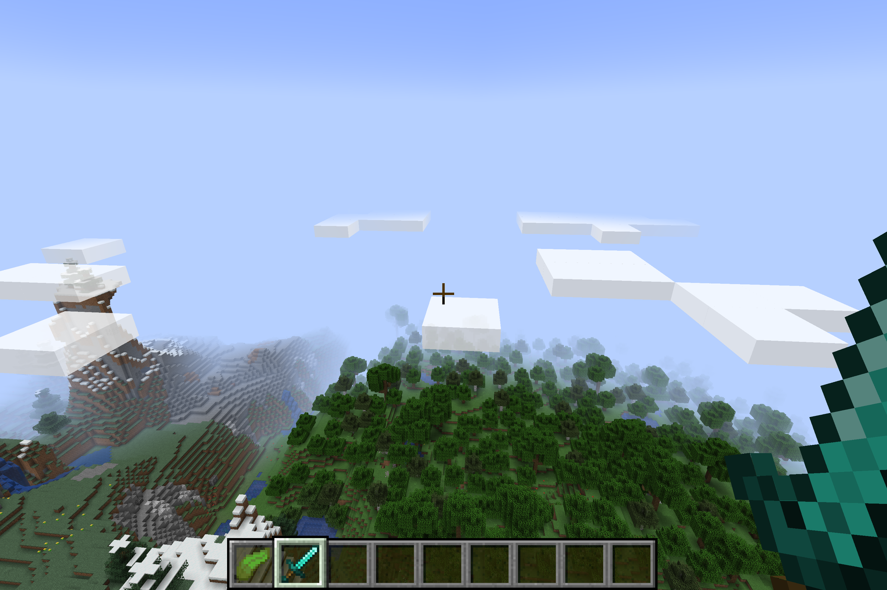

## 起因（与正文无关）

今天上午在图书馆学习红黑树的时候开起了小差，想看看aur上最受欢迎的都是哪些软件。然后突然发现了一个[minecraft-launcher](https://aur.archlinux.org/packages/minecraft-launcher/)的包，于是就下载下来准备试一试。

结果发现这是正版启动器qwq想起来我初中时候最开始还是通过第三方启动器（也就是盗版）接触到MC的（当时的版本似乎是1.6.4左右？）当时听说MineCraft的开发者Notch表示：“Just pirate it. If you still like it when you can afford it in the future, buy it then. Also don't forget to feel bad.”[^1]于是心想自己长大后一定要买一份正版。虽然现在还并没有经济独立，不过拿结余的生活费买下当年的梦想，也挺好的hhh于是就入手了一个Java版 :satisfied:

不过想了想，在图书馆玩游戏还是不太好。于是晚上就提前回去了，准备体验一下正版的感受（居然已经到了1.17.1）

结果打开之后发现非常卡，这才想起来，我没有安装电脑的独显驱动 :cold_sweat: 刚装好arch的时候尝试过安装，结果给我整黑屏了好几次，遂放弃 :joy: 但是为了能玩到正常的MC，今天决定再折腾一下！

## 正常安装

这里我选择的是Nvidia闭源驱动+PRIME的双显卡解决方案，参考了网上找到的博客文章[^2]。首先安装Intel的显卡驱动，不过我早就装过了。注意`lib32-mesa`这个包需要开启`multilib`仓库。

```bash
pacman -S mesa lib32-mesa
```

然后安装Nvidia闭源驱动，注意`lib32-nvidia-utils`这个包需要开启`multilib`仓库。

```bash
pacman -S nvidia lib32-nvidia-utils
```

接着安装`nvidia-prime`

```bash
pacman -S nvidia-prime
```

然后重启，就可以了！之后如果需要用到独显，就在命令前增加一个`prime-run`就可以了。还可以通过以下命令来检测是否成功：

```bash
 ~  prime-run glxinfo | grep "OpenGL renderer"
OpenGL renderer string: NVIDIA GeForce MX250/PCIe/SSE2
```

## 问题与解决

于是我马上运行

```bash
prime-run minecraft-launcher
```

已经迫不及待想开始游戏了！

结果点击开始游戏后，加载了一会就崩溃了，“**一个未知的错误导致了游戏崩溃**” :sob:

同时，我还注意到，在运行`xrandr --listproviders`的时候，本来会返回两个显卡的结果，但是此时只有集成显卡！独显好像没有被`xrandr`检测到！于是我从这一点出发，在arch的bbs上查到了一个帖子[^3]，解决了问题。出现问题的原因是，在系统启动时，nvidia 内核模块在显示管理器之后才加载。由[^3]和[^4]可知

1. 首先修改`/etc/mkinitcpio.conf`，将`nvidia`加入到`MODULES=()`中。

2. 然后运行

   ```bash
   sudo mkinitcpio -P
   ```

   每次更新了Nvidia驱动之后都需要运行一次，因此可以使用Pacman Hooks来自动化这一过程。创建新文件`/etc/pacman.d/hooks/nvidia.hook`，并写入如下内容：

   ```bash
   [Trigger]
   Operation=Install
   Operation=Upgrade
   Operation=Remove
   Type=Package
   Target=nvidia
   Target=linux
   # Change the linux part above and in the Exec line if a different kernel is used
   
   [Action]
   Description=Update Nvidia module in initcpio
   Depends=mkinitcpio
   When=PostTransaction
   NeedsTargets
   Exec=/bin/sh -c 'while read -r trg; do case $trg in linux) exit 0; esac; done; /usr/bin/mkinitcpio -P'
   ```

3. 接着在`/etc/default/grub`的`GRUB_CMDLINE_LINUX_DEFAULT`中添加`nvidia-drm.modeset=1`的内核参数，再重新运行

   ```bash
   sudo grub-mkconfig -o /boot/grub/grub.cfg
   ```

   来生成`grub.cfg`文件。

4. 重启电脑，然后就可以了！

现在来运行一下`xrandr --listproviders`，一切看起来都很正常。

```bash
 ~  xrandr --listproviders
Providers: number : 2
Provider 0: id: 0x45 cap: 0xf, Source Output, Sink Output, Source Offload, Sink Offload crtcs: 3 outputs: 3 associated providers: 0 name:modesetting
Provider 1: id: 0x254 cap: 0x0 crtcs: 0 outputs: 0 associated providers: 0 name:NVIDIA-G0
```

最后`prime-run minecraft-launcher`，成功进入了游戏，而且完全没有卡顿了 :laughing: 这时候风扇开始转了起来。忽然想起来自从开始用arch之后，因为没用过独显，还是第一次听到呼呼的风扇声音hhhh



[^1]: Notch's Twitter <https://twitter.com/notch/status/157261795139125248>
[^2]: ArchLinux 下双显卡配置 <https://blog.sakuya.love/archives/linuxgpu/>
[^3]: [SOLVED] Nvidia card fails-can't be detected by xrandr --listproviders <https://bbs.archlinux.org/viewtopic.php?id=260976>
[^4]: NVIDIA#DRM_kernel_mode_setting - ArchWiki <https://wiki.archlinux.org/title/NVIDIA#DRM_kernel_mode_setting>
