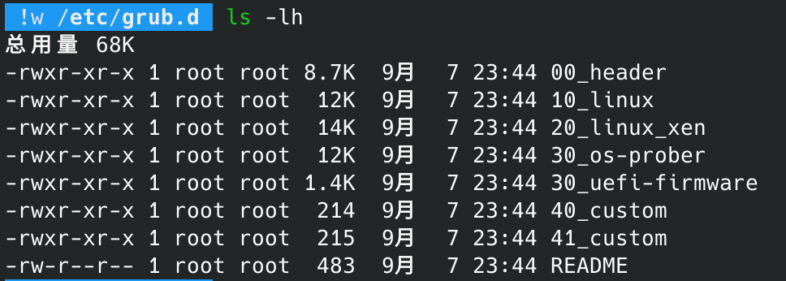
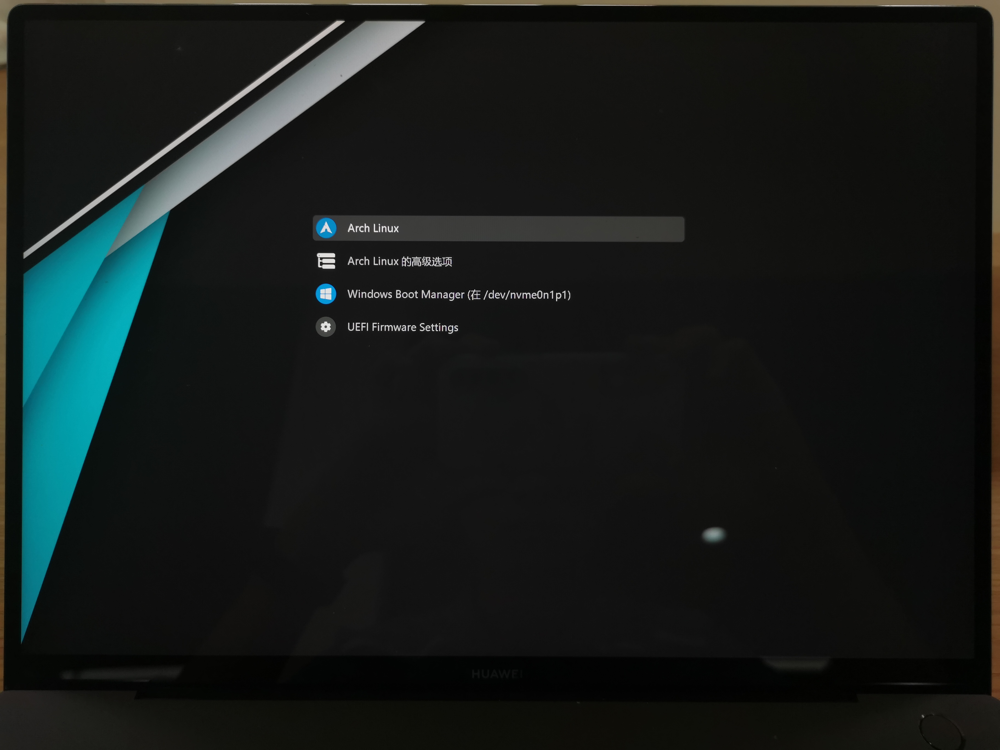

## 正常步骤

觉得grub界面太丑想要美化一下->搜索到喜欢的主题（我用的是[Vinceliuice大佬制作的Vimix](https://github.com/vinceliuice/grub2-themes)）->进行安装完成美化

## 出现问题

### 中文字体

我的grub界面是有中文的，但是主题默认的字体是Dejavu Sans，不包含中文。因此我需要自定义字体，大概有如下几个步骤：

1. 找到自己喜欢的字体，我这里选择的是微软雅黑，使用Win10自带的`msyh.ttc`。这个`.ttc`文件是Microsoft YaHei和Microsoft YaHei UI两种字体的打包。
2. 使用`grub-mkfont`指令，将其转化为grub可用的`.pf2`格式。但是这里对字体的原格式有要求[^1]。于是我找了个小工具，从`msyh.ttc`中提取出了两个`.ttf`文件，然后对Microsoft YaHei字体对应的`.ttf`文件进行转化。同时也需要注意设置好字体的大小。

    ```bash
    grub-mkfont -s 32 -o msyh_32.pf2 msyh.ttf
    ```

3. 将得到的字体放入主题所在的文件夹`/usr/share/grub/themes/[主题名]`。
4. 修改`theme.txt`，将`item_font`改成该字体的**全称**和大小[^1]。然后再用`grub_mkconfig`生成配置文件并重启就好了。

   这里的“**全称**和大小”，我一开始填写的是`Microsoft YaHei 32`，然后发现grub找不到这个字体，查了半天资料也没啥头绪 :broken_heart: 最后把它改成`Microsoft YaHei Regular 32`，就正常了 :sob:

### 自定义icon

折腾好字体后，我发现启动界面的4个选项中，“ArchLinux高级启动”和“UEFI”这两个选项是没有icon的。我根据[^2]和[^3]这两个Issue解决了问题。

1. 首先去[^3]中下载这位用户制作的图标，并且命名为`submenu.png`，放入`/usr/share/grub/themes/[主题名]/icons`。（这个图标用于高级启动，而下载的主题中提供了UEFI的图标）
2. 然后进入到`etc/grub.d`，可以看到以下几个文件

    

3. 其中，`10_linux`包含了ArchLinux的启动项和ArchLinux高级启动，`30_os-prober`包含了Windows的启动项，`30_uefi-firmware`包含了UEFI选项。~~其它几个不知道是干嘛的~~因此我们需要修改`10_linux`和`30_uefi-firmware`。

4. 实际上只需要给对应的启动项加上一个`--class`选项就可以了，这样grub就会到其使用的主题的icons文件夹中寻找名称与`--class`选项相同的图片。因此我们在`10_linux`的第286行加上`--class submenu`，修改好之后的这行如下：

    ```bash
    echo "submenu '$(gettext_printf "Advanced options for %s" "${OS}" | grub_quote)' --class submenu \$menuentry_id_option 'gnulinux-advanced-$boot_device_id' {"
    ```

    在`30_uefi-firmware`的第40行加上`--class efi`，修改好之后的这行如下：

    ```bash
    menuentry '$LABEL' --class efi \$menuentry_id_option 'uefi-firmware' {
    ```

    这样就可以了。

## 完成图

~~没啥好办法只能用手机拍屏幕了~~



[^1]: Grub2 theme / reference <http://wiki.rosalab.ru/en/index.php/Grub2_theme_/_reference#Font_name>
[^2]: Issue 136: Icon Request: Advanced options and UEFI firmware settings <https://github.com/vinceliuice/grub2-themes/issues/136>
[^3]: Issue 116: Add Icon: submenu <https://github.com/vinceliuice/grub2-themes/issues/116>
