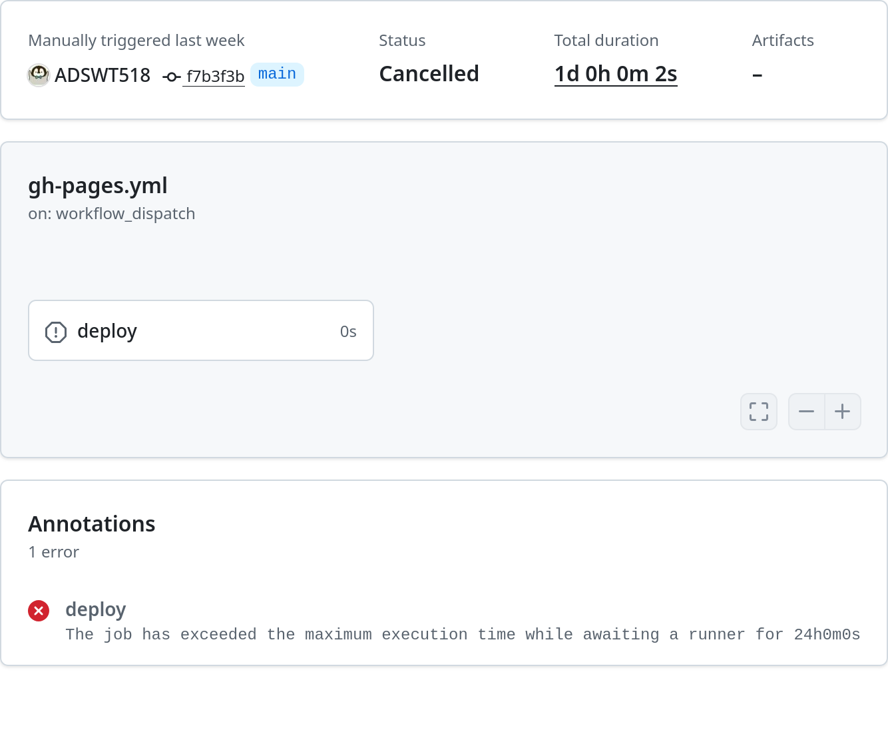
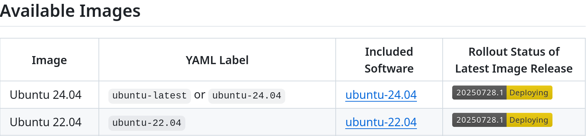

## 问题表现

这个action一直queued，然后24小时后超时，自动结束。但是我运行其他的action都正常。

## 解决方案

1. 首先把 `gh-pages.yml` 文件发给LLM让它分析，它告诉我

    > 确保使用的运行器标签正确：该工作流使用runs-on: ubuntu-20.04，这是GitHub托管的运行器标准标签，应该可用。但可以尝试更新到ubuntu-latest或ubuntu-22.04，以使用更新的运行器环境。

2. 然后去查了一下，发现Available Images里根本没有20.04[^1]，原来在今年四月给移除了[^2]。

    

3. 然后把 `gh-pages.yml` 中的 `ubuntu-20.04` 改成 `ubuntu-latest` 就正常了
    
    [chore: update github actions image to ubuntu-latest · ADSWT518/ADSWT518.github.io@80747b2](https://github.com/ADSWT518/ADSWT518.github.io/commit/80747b2a342414f794d62f68886218a9560e0ff3)

[^1]: [actions/runner-images: GitHub Actions runner images](https://github.com/actions/runner-images)

[^2]: [Ubuntu 20 Deprecation changes by Prabhatkumar59 · Pull Request #11748 · actions/runner-images](https://github.com/actions/runner-images/pull/11748)
